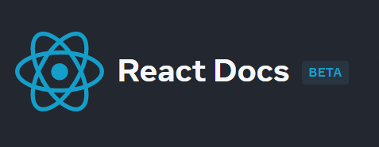

<h2>React Docs</h2>

Bem-vindo à documentação do React! Esta página fornecerá uma introdução aos 80% dos conceitos do React que você usará diariamente.

Aprenda a pensar em React com explicações passo a passo e exemplos interativos.

<strong>Acesso à documentação (inglês):</strong> <a href="https://beta.reactjs.org/learn">https://beta.reactjs.org/learn</a>

O que é este site?

Estamos reescrevendo a documentação do React com algumas diferenças:

<ul>
  <li>Todas as explicações são escritas usando Hooks em vez de classes.</li>
  <li>Adicionamos exemplos interativos e diagramas visuais.</li>
  <li>Os guias incluem desafios (com soluções!) para verificar sua compreensão.</li>
  <li>Este site beta contém o rascunho atual dos novos documentos.</li>
</ul>

<h3>Tempo Estudando a documentação</h3>

  

<h4><b>Status da documentação:</b> :speech_balloon: Estudando</h4>
